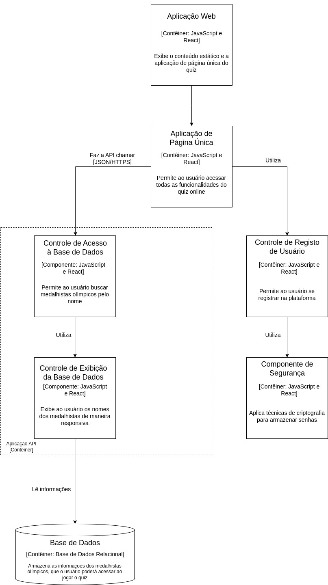

# Olympiquiz
- Pedro da Rosa Pinheiro - 231081
- Henrique de Lima Sousa Flores - 223911
- Luiz Felipe Corradini Rego Costa - 230613
- André Santos Rocha - 235887
- Mariano Cho - 230797

# Arquitetura do projeto

## Diagrama de componentes

## Estilo arquitetural
> Para o nosso projeto, optamos pelo estilo MVC (Model-View-Controller). Optamos por esse estilo devido à sua grande compatibilidade com aplicações web e tambem devido ao maior nível de organização que ele garante ao projeto.
> É possível explicar nosso projeto sob a ótica MVC da seguinte forma:
> * O usuário interage com a View, ou seja, com a página web do quiz.
> * A View comunica o Controller, que irá interpretar os dados obtidos na interação do usuário.
> * O Controller busca no Model os dados ou serviços necessários para atender à solicitação do usuário. 
> * O Model soluciona a solicitação e comunica o Controller novamente.
> * Por fim o Controller processa a resposta do Model e atualiza a View de acordo com esse processamento.
> Dessa forma, somos capazes de implementar, por exemplo, sistemas de cadastro de usuário e de aquisição de dados, facilitando o desenvolvimento e a manutenção do código, a aplicação de testes e favorecendo a separação de responsabilidades dentro do programa.
## Principais componentes
> Como evidenciado no diagrama, é possível apontar dois principais componentes em nosso contêiner API: o controle de acesso à base de dados e o controle de exibição da base de dados.
> Como a aplicação gira em torno do quiz de advinhação de medalhistas, é preciso permitir ao usuário dar palpites sobre quem ele imagina ser o medalhista. O controle de acesso consiste justamente na possibilidade do usuário poder fornecer o nome de medalhistas válidos, verificados em nossa base de dados.
> Além disso, entendemos também que nem todos os medalhistas são amplamente conhecidos ou que alguns possuem nomes não usuais ao nosso cotidiano. Por isso, o controle de exibição de dados recebe em tempo real o que está sendo digitado pelo usuário e exibe a ele uma lista de todos os medalhistas cujo nome tenha alguma correspondência ao texto digitado. Isso promove fluidez e dinamicidade ao quiz, melhorando a experiência do usuário.   
